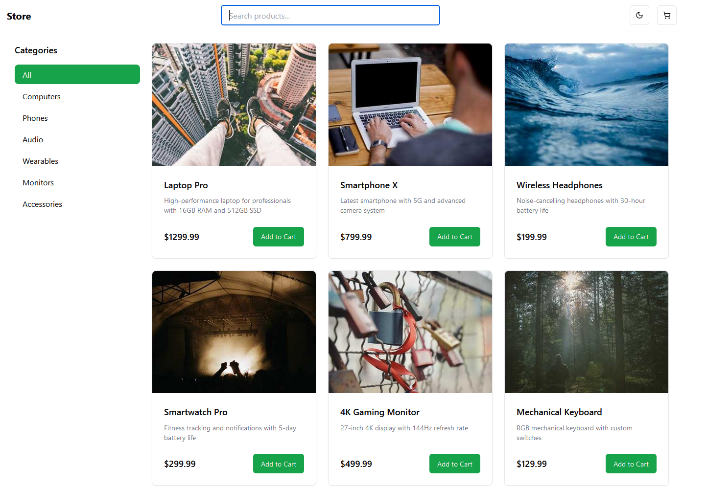

# E-commerce Store

A clean and modern e-commerce store page prototype built with React and Shadcn UI components. This project demonstrates a simple product listing page with a responsive layout, dark/light mode support, and modern UI components.

## 📸 Preview

## 🚀 Features

- 📦 Product card displays
- 🌓 Dark/Light mode toggle
- 📱 Responsive layout
- 🎯 Clean and minimal interface
- 🎨 Modern UI components
- 🏷️ Product categorization
- 🔍 Basic product filtering

## 🛠️ Tech Stack

- React + TypeScript
- Tailwind CSS
- Shadcn UI
- Vite

## 🛠️ Tech Stack

- React + TypeScript
- Tailwind CSS
- Shadcn UI
- Vite

## 📦 Installation

bash
git clone https://github.com/yourusername/your-repo-name.git

2. Navigate to the project directory:

bash
cd your-repo-name

3. Install dependencies:

bash
npm install

4. Start the development server:

bash
npm run dev

Your application should now be running on `http://localhost:5173`

## 🔧 Environment Setup

Make sure you have the following installed:
- Node.js (v16 or higher)
- npm (v7 or higher)

## 🗂️ Project Structure

src/
├── assets/ # Static assets
├── components/ # React components
│ └── ui/ # UI components
├── lib/ # Utility functions
└── styles/ # Global styles